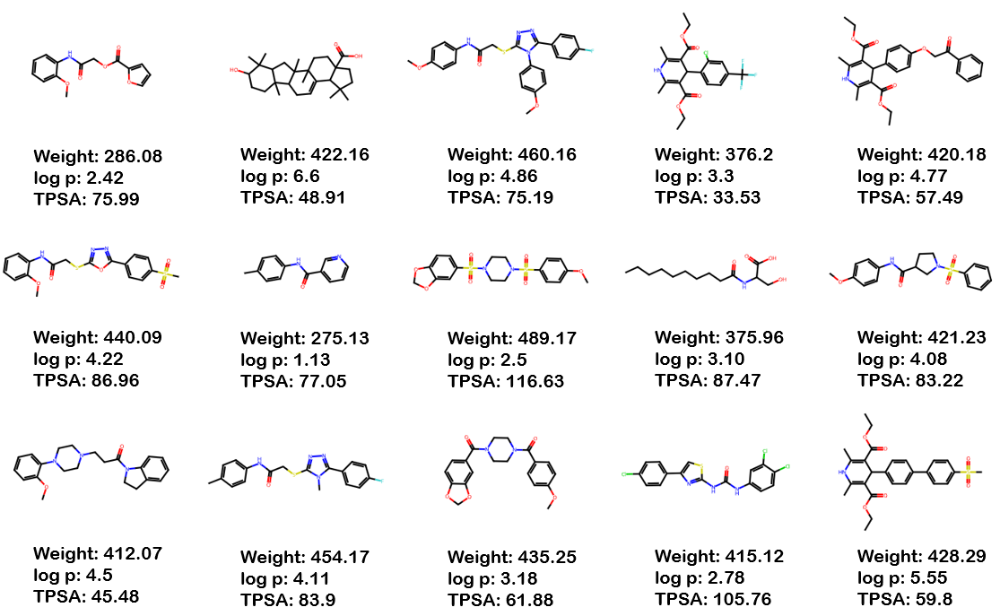

This repository contains the PyTorch implementation of the molecule generation models. Our goal is to create a Neural Networks that generates a molecules that meet multiple property conditions. We implemented a transformer-based model and a contrastive learning-based model for molecular design. We tested each different models using the ChEMBL dataset.

## Generated molecular visualization results 

## Latent space visualization of contrastive learning-based VAE
The result of visualizing the latent space distribution of the last layer of the encoder using 200,000 validation datasets

## Comparison of validity, uniquenss, and novelty evaluation metrics
@K means the result of each indicator when K is generated
|Model|Validity(↑) @1000|Uniqueness(↑) @1000|Novelty(↑) @1000|
|------|---|---|---|
|Char-RNN||||
|Tranformer-VAE|0.844|0.944|0.902|